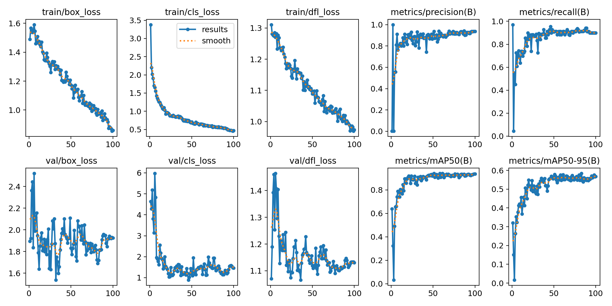
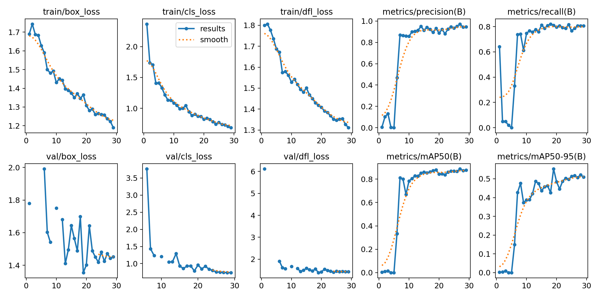

# YOLO Model Comparison for License Plate Detection

Bu repo, farklı YOLO modellerinin (YOLO11n ve YOLO11m) plaka tespiti performanslarını karşılaştırmaktadır. 

Üç farklı eğitim sonucunu inceledik. Modeller ve eğitim yapılandırmaları aşağıda listelenmiştir.

## Karşılaştırılan Modeller

### 1. Model 1: YOLO11n (Plaka Modeli)
- **Model**: `yolo11n.pt`
- **Epoch**: 100
- **Veri Seti**: Orijinal Veri Seti
- **Sonuçlar (100. Epoch)**:
  - **Precision**: %93.65 (0.936)
  - **Recall**: %89.86 (0.899)
  - **mAP50**: %93.65 (0.936)
  - **mAP50-95**: %56.80 (0.568)

YOLO11n modeli daha küçük bir model olmasına rağmen 100 epoch eğitildiği için yüksek precision ve recall değerlerine ulaşmıştır. mAP skorları oldukça başarılıdır.

### 2. Model 2: YOLO11m (Eğitim Run 1)
- **Model**: `yolo11m.pt`
- **Epoch**: 30 (29 epoch tamamlandı)
- **Veri Seti**: 500 Görsellik Alt Küme (dataset_500)
- **Sonuçlar (29. Epoch)**:
  - **Precision**: %94.66 (0.947)
  - **Recall**: %80.58 (0.806)
  - **mAP50**: %87.71 (0.877)
  - **mAP50-95**: %50.89 (0.509)

YOLO11m modeli daha büyük bir mimariye sahip olsa da bu testte yalnızca 30 epoch çalıştırılmış ve daha küçük bir veri kümesi kullanılmıştır. Precision daha yüksekken Recall değerinde bir miktar düşüş yaşanmıştır.

### 3. Model 3: YOLO11m (Eğitim Run 2)
- **Model**: `yolo11m.pt`
- **Epoch**: 30
- **Veri Seti**: 500 Görsellik Alt Küme (dataset_500)
- **Sonuçlar (30. Epoch)**:
  - **Precision**: %92.61 (0.926)
  - **Recall**: %84.30 (0.843)
  - **mAP50**: %90.54 (0.905)
  - **mAP50-95**: %54.22 (0.542)

Aynı konfigürasyonlarla yapılan ikinci YOLO11m eğitiminde Recall ve mAP skorlarında önceki run'a göre iyileşme görülmektedir. Toplam performans YOLO11n'in (100 epoch) biraz altında kalmıştır ancak bunun sebebi az sayıdaki epoch ve veri sayısıdır.

## Sonuç Özeti

| Model | Epoch | Precision | Recall | mAP50 | mAP50-95 | Veri Seti |
|-------|-------|-----------|--------|-------|----------|-----------|
| YOLO11n | 100 | **0.936** | **0.899** | **0.936** | **0.568** | Orijinal Data |
| YOLO11m (Run 1) | 30 | 0.947 | 0.806 | 0.877 | 0.509 | 500 Görsel |
| YOLO11m (Run 2) | 30 | 0.926 | 0.843 | 0.905 | 0.542 | 500 Görsel |

### Değerlendirme
- En iyi genel performansı mAP50 ve Recall bazında **YOLO11n (100 Epoch)** vermiştir. 
- YOLO11m modeli daha karmaşık olsa da 500 görsellik alt kümeyle ve sadece 30 epoch eğitildiğinden tam potansiyeline ulaşmamış görünmektedir.
- Daha güçlü olan YOLO11m modelini veri setinin tamamında ve 100+ epoch çalıştırarak en iyi model performansına erişilmesi önerilir.
